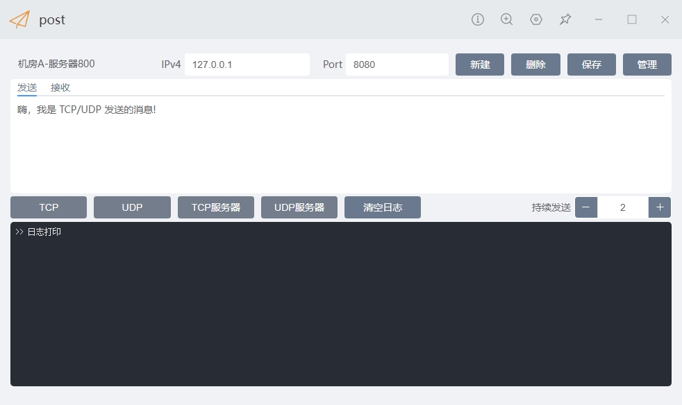
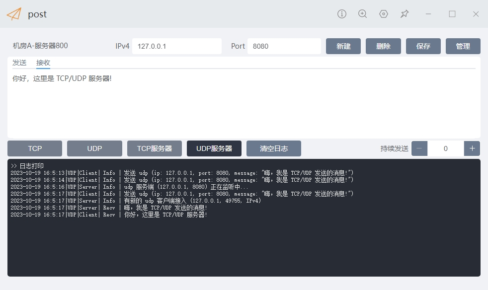
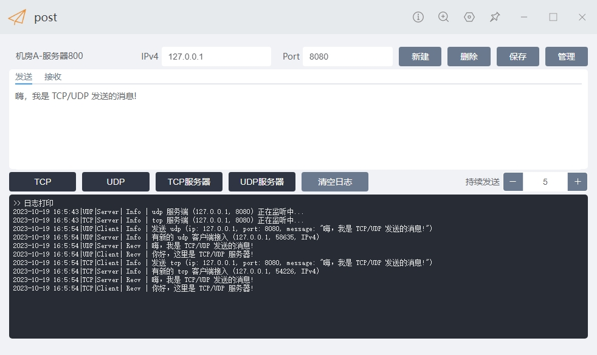
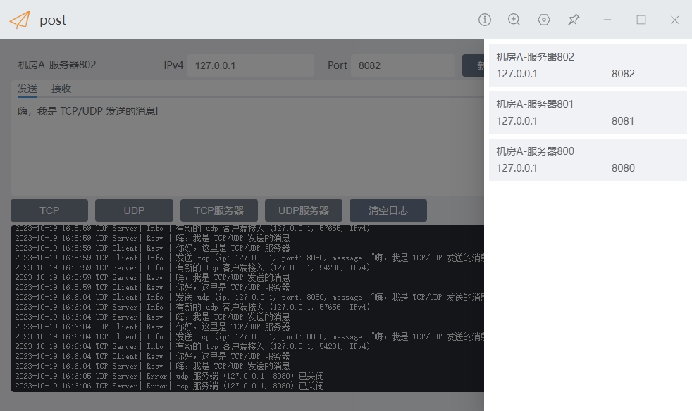

# uTools-post

方便快速的发送、接受数据包（例如 tcp/udp）。

## Demo









## Todo

- [x] 客户端管理
- [x] UDP server/client
- [x] TCP server/client
- [x] 自定义发送数据内容
- [x] 自定义接收数据内容
- [x] 持续发送
- [x] 附带时间的日志输出

## 数据结构

```json
{
    "uuid": "70150c51-98d4-4f76-9da3-70fb967afb61",
    "name": "机房-服务器1",
    "ipv4": "192.168.1.10",
    "port": "8080",
    "interval": 0,
    "client": "嗨，我是 TCP/UDP 发送的消息!",
    "server": "你好，这里是 TCP/UDP 服务器!"
}
```