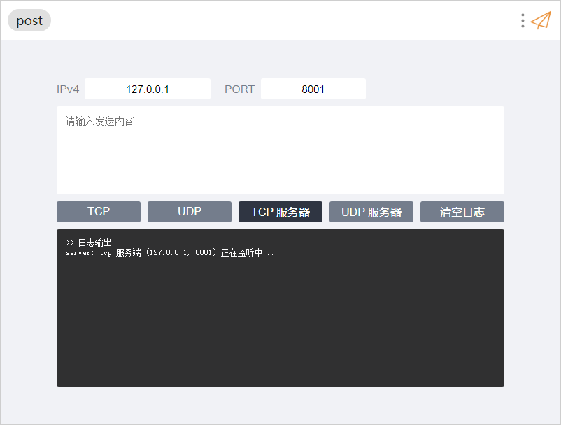
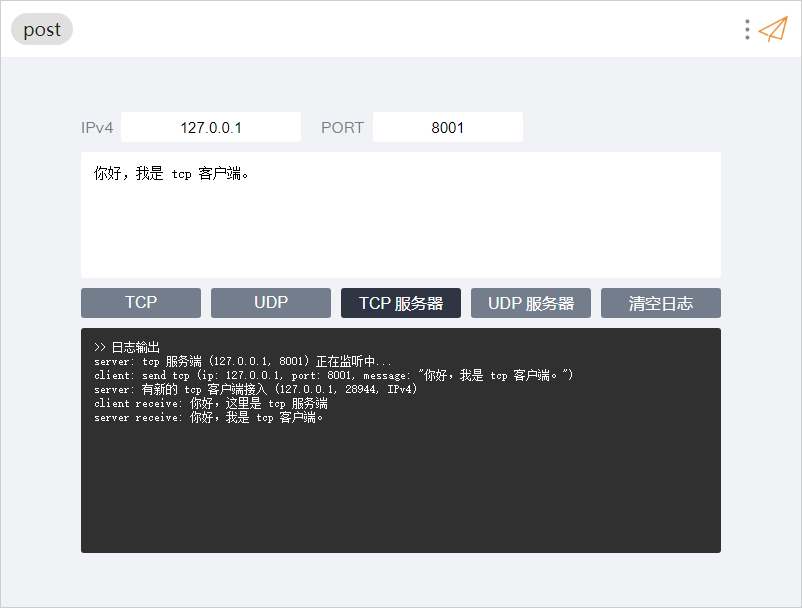
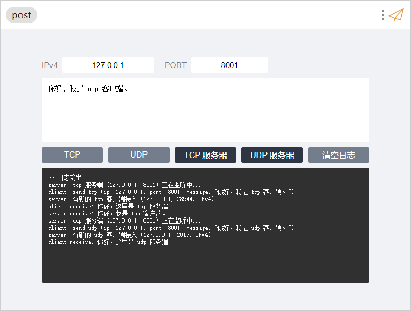

# uTools-post

方便快速的发送、接受数据包（例如 tcp/udp）。

## Demo







## Todo

- [ ] 客户端管理
- [ ] UDP server/client
- [ ] TCP server/client
- [ ] 自定义发送数据内容
- [ ] 自定义接收数据内容
- [ ] 持续发送
- [ ] 附带时间的日志输出

## 数据结构（待修改）

```json
[
    {
        "name": "分组名",
        "ipv4": "",
        "port": "",
        "interval": "",
        "client": "",
        "server": "",
        "text": ""
    }
]
```